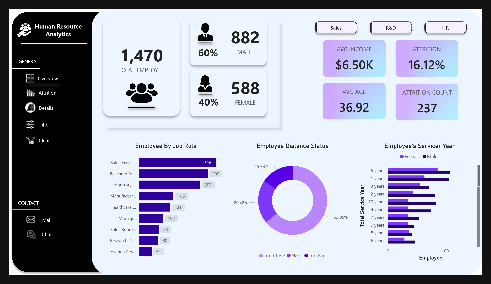

# HR Dashboard Analytics

🌐 Live Dashboard: [hrdashboardanalytics.netlify.app](https://hrdashboardanalytics.netlify.app/)




Overview
HR Dashboard Analytics is an interactive and insightful dashboard created using Power BI. It provides HR professionals with a comprehensive view of workforce metrics, including employee demographics, performance trends, and retention analytics.

This project simplifies decision-making by offering visually engaging and easy-to-understand data visualizations.

* Features 

📊 Employee Demographics :
Analyze employee distribution by gender, age, department, and location. 

🚀 Performance Metrics :
Monitor productivity, employee KPIs, and achievement levels.

🔍 Retention Analysis : 
Gain insights into employee satisfaction and attrition trends.

🎯 Custom Filters :
Drill down and filter data by job roles, departments, or locations for better insights.

📈 Interactive Visualizations : 
Dynamic charts, graphs, and slicers for exploring key metrics in depth.

## Tech Stack

* Visualization Tool: Power BI

* Data Sources: kaggle, SQL Server, or other database systems

* Hosting: Netlify


## Getting Started- Installation
Follow the steps below to get started with this project.

Prerequisites
Ensure you have the following:

Power BI Desktop installed (Download here).
Dataset (available in this repository or linked externally).
Installation and Usage
Clone the Repository
Clone this repository to your local system using the following command:

```bash
git clone https://github.com/your-username/hr-dashboard-analytics.git
cd hr-dashboard-analytics
```
Open the Power BI File

Open the .pbix file in Power BI Desktop.
Connect the file to your dataset (if required).

Refresh Data
In Power BI, click Refresh to load the latest data from the connected source.

Publish to Power BI Service

Publish the dashboard to the Power BI Service for web access.
Alternatively, export visuals and host them on the provided Netlify URL.


## Contributing

Pull requests are welcome. For major changes, please open an issue first
to discuss what you would like to change.

Please make sure to update tests as appropriate.

## License

[MIT](https://choosealicense.com/licenses/mit/)
